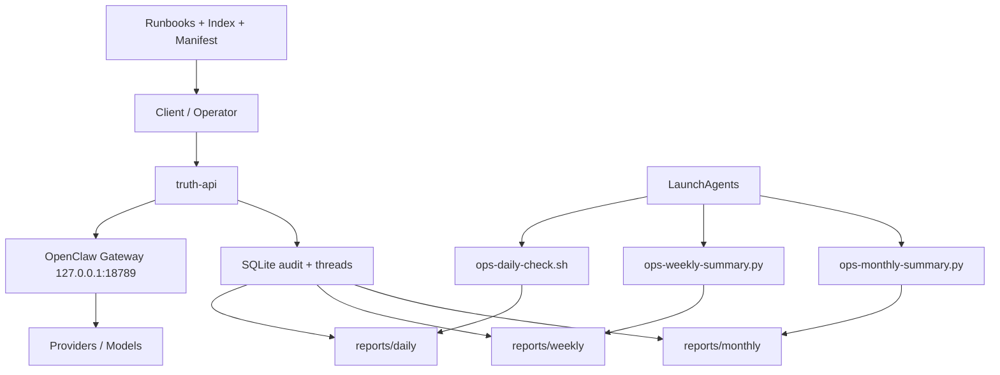

# ops-architecture.md

# truth-api Ops Architecture

## 1. Purpose

This document describes the local operations architecture for the in spirit truth-api service.

It explains how the following layers fit together:
- truth-api application layer
- OpenClaw runtime layer
- launchd scheduling layer
- reports and runbooks layer
- operator workflow layer

## 2. Runtime context

Current local environment assumptions:

- Host machine: Mac mini
- truth-api project root:
  `/Users/tongwei/.openclaw/inspirit-truthos/apps/truth-api`
- truth-api bind:
  `127.0.0.1:8010`
- OpenClaw Gateway bind:
  `127.0.0.1:18789`
- OpenClaw config:
  `~/.openclaw/openclaw.json`
- Reports root:
  `~/.openclaw/reports`
- Logs root:
  `~/.openclaw/logs`

## 3. Layer map

### Layer A — Application boundary
truth-api is the policy boundary layer.

Responsibilities:
- authentication
- role enforcement
- model policy lookup
- audit logging
- thread lifecycle handling

### Layer B — Runtime gateway
OpenClaw Gateway is the orchestration/runtime layer.

Responsibilities:
- model/provider access
- agent runtime
- upstream gateway token validation
- shared platform routing behavior

### Layer C — launchd automation
macOS LaunchAgents are the time and lifecycle layer.

Key jobs:
- `ai.inspirit.truth-api`
- `ai.openclaw.gateway`
- `ai.inspirit.ops-daily-check`
- `ai.inspirit.ops-weekly-summary`
- `ai.inspirit.ops-monthly-summary`

### Layer D — Operational memory
Reports and runbooks are the memory layer.

Artifacts:
- daily reports
- weekly summaries
- monthly summaries
- incident postmortems
- runbook manifest
- runbook index

## 4. Data flow

### Service path
1. Client calls truth-api.
2. truth-api authenticates user and resolves policy.
3. truth-api calls OpenClaw Gateway.
4. OpenClaw routes to configured provider/model.
5. truth-api records audit and thread events.

### Ops path
1. launchd runs scheduled ops jobs.
2. ops scripts collect health, audit, and DB signals.
3. reports are rendered into markdown/json artifacts.
4. operator reviews outputs and updates runbooks when needed.

## 5. Main files

### App and scripts
- `app/main.py`
- `scripts/ops-status.py`
- `scripts/ops-daily-check.sh`
- `scripts/export-audit-log.py`
- `scripts/render-daily-report.py`
- `scripts/ops-weekly-summary.py`
- `scripts/ops-monthly-summary.py`
- `scripts/render-incident-postmortem.py`

### Guides
- `README-dev.md`
- `README-prod.md`
- `README-ops-rhythm.md`
- `README-runbooks-index.md`
- `incident-checklist.md`
- `rotate-secrets.md`

### launchd
- `launchd/ai.inspirit.ops-daily-check.plist`
- `launchd/ai.inspirit.ops-weekly-summary.plist`
- `launchd/ai.inspirit.ops-monthly-summary.plist`

## 6. Architecture principles

1. Keep truth-api and OpenClaw responsibilities separate.
2. Treat reports as operational memory, not decoration.
3. Prefer one command entry point for humans.
4. Prefer scheduled jobs for repetitive checks.
5. Convert repeated incidents into runbooks.

## 7. Human entry points

### Manual
```bash
make ops-report
python scripts/ops-status.py
python scripts/export-runbook-manifest.py --format md --output /Users/tongwei/.openclaw/reports/runbook-manifest.md
```

### Scheduled
- launchd daily report generation
- launchd weekly summary generation
- launchd monthly summary generation

## 8. Diagram



## 9. Principle

An ops system matures when service health, documentation, schedule, and memory all reinforce each other.
