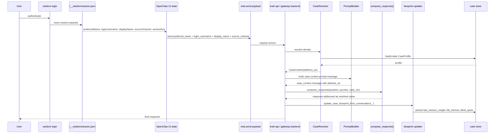

# Case Identity Sequence

## Scope

This document describes the Phase 1.5 case identity path for wisdom login, frontend state hydration, chat request metadata, backend case resolution, prompt construction, response composition, and minimal blueprint writeback.

## Naming Priority

Highest to lowest:

1. `preferred_name` from request/session metadata
2. stored `preferred_name` in `CaseProfile`
3. `login_username`
4. `display_name`
5. workspace default name
6. generic fallback `"你"`

## Sequence

## Hank Acceptance Path

When `session.json` returns `preferredName = "Hank"`:

- frontend state keeps `preferredName = "Hank"`
- chat metadata includes `preferred_name = "Hank"`
- backend request model accepts `preferred_name`
- `CaseResolver` resolves `address_as = "Hank"`
- `PromptBuilder` serialises `Address as: Hank`
- `compose_response()` addresses the user as `Hank`
- workspace default naming never overrides this path
